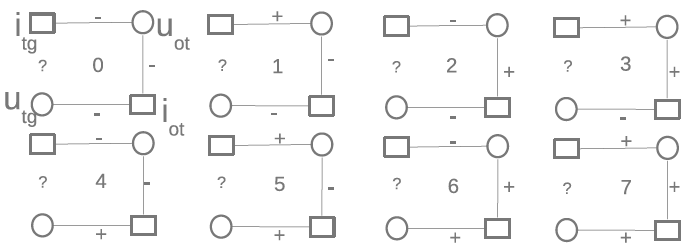

## Introduction

Earlier this year my colleagues and I participated in both tracks of the [Yahoo! KDD Cup](https://kdd.org/kdd-cup/view/kdd-cup-2011). To give some background, the KDD Cup is the biggest annual machine learning competition (at least unpaid). This year Yahoo! sponsored the event and released a dataset of around 250 million music ratings on genres, artists, albums, and tracks (“items”). There were two different tracks in the competition. Track 1 was concerned with predicting the ratings a user gave on a held-out test set (regression) and Track 2 was focused on predicting whether a user would love or hate a given item (binary classification).

I ended up leaving the company sponsoring my work early in the competition to join [GetGlue](https://en.wikipedia.org/wiki/Tvtag) as their data scientist, effectively ending my contributions code-wise. I was around #3 or #4 in Track 1 at the time with a blended matrix factorization algorithm. It looked at a few temporal and hierarchical features and was solved using a simple gradient descent algorithm with an adaptive learning rate. It was still good enough for 24th place overall. I don't know the exact number of teams, but I heard unofficially that it topped over 1,000. My colleague, [Joseph Kong](https://dblp.org/pid/57/3047.html) stayed on and continued to work part time on Track 2 where we (mostly he) placed 9th. Unlike other competitors ahead of us though, we did not use an ensemble stack (other than stacking our own algorithm with parameter variations). The best single method was around 3.7%. Most of the top MF-BPR algorithms could only achieve about what we did on the Test1 set.

## A Primer on Square Counting

We differed from most of the competitors due to Joseph coming up with a radical “square counting” algorithm. He was inspired by triangle counting in graph mining.

So let's say we want to see if you'll like song A. You and a friend both love song B and you and another friend hate song C. The first friend loves A, but the second friend hates it. The situations with the two friends are modeled in the above figure, specifically in configurations 7 and 0. Now let's expand this to thousands of friends. We can actually count the configurations for each person/song pair we want to predict reducing each pair into a feature vector of length 23. The feature vectors can then be passed into your classic classification algorithm of choice. Of course, there are other subtleties like normalizing the counts based on the degrees of the nodes and other enhancements we made to get down to a 4.6% error rate, but the basic idea is pretty simple. There is also the problem of designing an efficient algorithm to actually do the square counting. Oh, and if you're wondering, our research shows that you'll most likely hate song A—hate is a better predictor.

## Conclusion

Square counting is an effective algorithm in a bipartite graph with a binary rating system. We have ideas on how to leverage square counting for regression (think soft-max) and other graph types, but this is simply the first iteration. It is essentially a feature extraction stage which transforms the problem from a sparse ratings matrix into a traditional classification problem. The nice part is you can easily parallelize it, then feed the output into any number of machine learning frameworks, which require far less processing time than would be required for a matrix factorization method. Using the [gbm package](https://cran.r-project.org/package=gbm) in R worked just fine for our use case.

[Read the paper](https://proceedings.mlr.press/v18/kong12a/kong12a.pdf) or view the [Just Count the Love-Hate Squares slides](https://www.slideshare.net/slideshow/just-count-the-lovehate-squares/9741700).
